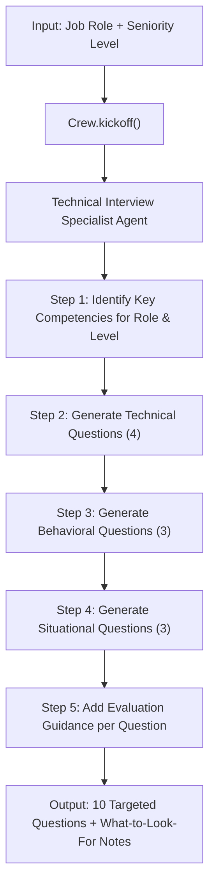

# Interview Question Generator Agent

AI-powered interview question generator built with CrewAI that creates tailored technical, behavioral, and situational questions for any role and seniority level with evaluation guidance.

## How It Works



The agent follows a structured pipeline:

1. **Competency Analysis** — Identifies the key skills and competencies that matter most for the given role at the specified seniority level.
2. **Technical Questions (4)** — Generates role-specific knowledge and skills questions scaled to the level.
3. **Behavioral Questions (3)** — Creates questions about past experience, teamwork, and conflict resolution.
4. **Situational Questions (3)** — Designs hypothetical scenarios relevant to the role and level.
5. **Evaluation Guidance** — Adds a "What to look for" note under each question describing what a strong answer includes.

## Project Structure

```
09-interview-question-generator/
├── agents.py           # Agent definition (Technical Interview Specialist)
├── tasks.py            # Task definition (interview question generation)
├── main.py             # Entry point — configure role/level and run
├── requirements.txt    # Python dependencies
├── .env.example        # Environment variable template
├── .gitignore          # Git ignore rules
└── README.md           # Project documentation
```

## Prerequisites

- **Python 3.10+**
- **OpenRouter API Key** — Get one at [openrouter.ai](https://openrouter.ai/)

## Setup

1. **Navigate to the project directory:**

   ```bash
   cd 09-interview-question-generator
   ```

2. **Create and activate a virtual environment:**

   ```bash
   python -m venv .venv
   source .venv/bin/activate        # macOS/Linux
   .venv\Scripts\activate           # Windows
   ```

3. **Install dependencies:**

   ```bash
   pip install -r requirements.txt
   ```

4. **Configure environment variables:**

   ```bash
   cp .env.example .env
   ```

   Open `.env` and add your OpenRouter API key:

   ```
   OPENROUTER_API_KEY=your_openrouter_api_key_here
   ```

## Usage

Run the agent with the default configuration (Senior Backend Developer):

```bash
python main.py
```

### Changing the Role and Level

Open `main.py` and modify the `role` and `level` variables:

```python
role = "Frontend Developer"
level = "junior"
```

Supported seniority levels:

| Level    | Focus Areas                                        |
|----------|----------------------------------------------------|
| Junior   | Fundamentals, learning ability, eagerness           |
| Mid      | Practical application, independence, problem-solving|
| Senior   | System design, mentorship, technical leadership     |
| Lead     | Architecture decisions, team management, strategy   |

Example roles: `Backend Developer`, `Frontend Developer`, `Data Scientist`, `DevOps Engineer`, `Product Manager`, `UX Designer`.

## Customization

- **Question count and mix** — Edit the task description in `tasks.py` to change the number of technical, behavioral, or situational questions.
- **Seniority scale** — Add or modify seniority levels and their focus areas in the task description.
- **Agent persona** — Adjust the agent's `backstory` in `agents.py` to shift the interview style (e.g., more focus on culture fit, system design, or coding ability).
- **LLM model** — Change the `model` parameter in `agents.py` to use a different model available on OpenRouter.
- **Output format** — Modify `expected_output` in `tasks.py` to change the structure of the generated questions.
